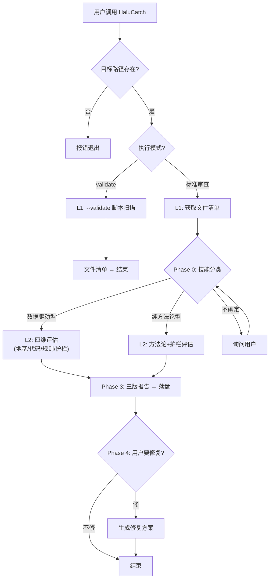

# HaluCatch / 捕幻

AI Skill **执行可靠性审查**工具。评估一个 Skill 被 AI 执行时，结果是否可信、是否可复现、是否经得起业务推敲。

> **Halu** = Hallucination（幻觉） | **Catch** = 捕获

---

## 动机

AI 执行 Skill 时，最常见的问题不是「不会做」，而是**以为自己会做但做错了**。原因有三：

1. **地基不稳** — 数据路径写死、格式未验证、没有骨架脚本
2. **规则歧义** — 自然语言描述的业务逻辑能被多种理解
3. **缺解读护栏** — AI 产出自信的错误结论，用户无从分辨

HaluCatch 扫描一个 Skill 包，从这三维度给出评级与修复建议。

---

## 执行流程



> 详细决策分支见 [decision-flowchart.html](docs/decision-flowchart.html)（本地渲染）或 [SKILL.md](SKILL.md) 底部决策树。

---

## 用法

## 快速开始

### 方式一：作为 AI Skill 使用

向 AI 提供目标 Skill 文件夹路径：

```
请用 HaluCatch 审查这个 Skill：/path/to/target-skill
```

AI 会自动扫描文件夹、分类 Skill 类型、执行评估、输出三份报告。

**用例 1 — 审查一个数据驱动型 Skill（含 .py 和数据文件）：**

```
请用 HaluCatch 审查 ./xxx-skill，看看这个自动生成报表的技能稳不稳。
```
→ 发现：路径硬编码、skiprows 固定为 6、无输入验证。评级：地基 🟠 有隐患。
→ 通俗版告知业务方「数据管道有两个问题需要修」；专业版给出具体行号和修复方案。

**用例 2 — 审查一个纯方法论型 Skill（无代码）：**

```
请用 HaluCatch 审查 ./standup-skill，看指令够不够清楚。
```
→ 发现：缺少异常分支处理、输出格式未定义。评级：方法论 🟡 有改进空间。
→ 通俗版：「这个技能在特殊情况下可能不知道该怎么办」；专业版：缺少的具体检查项。

**用例 3 — 审查一个含数据但无骨架脚本的 Skill：**

```
请用 HaluCatch 审查 ./churn-analysis。
```
→ 发现：SKILL.md 描述复杂统计逻辑但无 .py 文件。评级：地基 🔴 无地基。
→ AI 询问：「检测到该 Skill 涉及数据处理但无骨架脚本，是否生成？」

### 方式二：直接运行骨架脚本

```bash
# 完整评估
python3 halucatch_core.py --skill-dir "/path/to/target-skill"

# 仅扫描文件清单
python3 halucatch_core.py --skill-dir "/path/to/target-skill" --validate

# 输出到指定目录
python3 halucatch_core.py --skill-dir "/path/to/target-skill" --output-dir ./reports
```

### 输出示例

审查完成后，目标 Skill 目录下会生成：

```
target-skill/
├── HaluCatch-report-2026-06-16.md              ← 专业版
├── HaluCatch-report-2026-06-16-通俗版.md         ← 通俗版
└── HaluCatch-report-2026-06-16-行动版.md         ← AI 行动版（含修复指引）
```
| 通俗版 | 业务方/非技术人员 | 白话 paraphrase，无术语 |
| AI 行动版 | 下次执行的 AI | 修复指引 + feedback 模板 |

---

## 文件结构

```
HaluCatch/
├── SKILL.md                  ← 流程指令（AI 读）
├── halucatch_core.py         ← 骨架脚本（标准化评估 + --validate）
├── README.md                 ← 项目说明（含 Mermaid 流程图）
├── docs/
│   └── decision-flowchart.html  ← 决策流程图（本地渲染）
├── tests/
│   ├── __init__.py
│   └── test_halucatch.py     ← 单元测试
└── .gitignore
```

---

## 四维评估框架

| 维度 | 检查什么 | 类型 |
|------|---------|------|
| 🏗️ **地基** | 数据管线是否稳固（.py/路径/validate） | 代码化扫描 |
| 🤖 **代码** | AI 复现篡改点（浮点/异常/p-value） | 代码化扫描 |
| 📝 **规则** | 业务口径有无歧义（映射/分类/边界） | AI 判断 |
| 🛡️ **护栏** | 解读规则是否到位（禁令/框架/自检） | AI 判断 |

前三项可靠，第四项需要目标 Skill 作者自觉配合。

---

## 同类项目对比

| | HaluCatch | CodeQL | ESLint |
|---|---|---|---|
| 审查对象 | AI Skill（markdown + python） | 源代码 | JavaScript |
| 检查范围 | 执行可靠性 + 业务规则 | 安全漏洞 | 代码规范 |
| 输出 | 三版报告 + 修复建议 | 告警列表 | 错误/警告 |
| 闭环 | ✅ 含修复指南 | ❌ 仅标记 | ❌ 仅标记 |

---

## 开发

```bash
git clone https://github.com/CoderMoray/HaluCatch.git
cd HaluCatch
# 编辑 SKILL.md 或 halucatch_core.py
git commit -m "your change"
git push
```

---

## 许可

MIT
