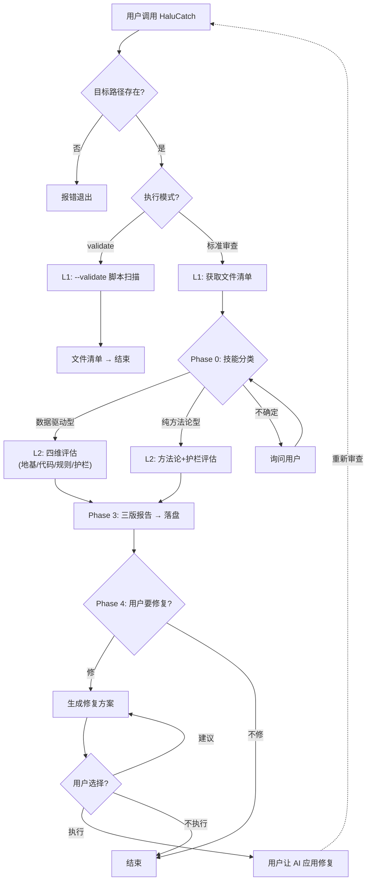

# HaluCatch / 捕幻

AI Skill **执行可靠性审查**工具。评估一个 Skill 被 AI 执行时，结果是否可信、是否可复现、是否经得起业务推敲。

> **Halu** = Hallucination（幻觉） | **Catch** = 捕获

---

## 动机

AI 执行 Skill 时，最常见的问题不是「不会做」，而是**以为自己会做但做错了**。原因有三：

1. **地基不稳** — 数据路径写死、格式未验证、没有骨架脚本
2. **规则歧义** — 自然语言描述的业务逻辑能被多种理解
3. **缺解读护栏** — AI 产出自信的错误结论，用户无从分辨

HaluCatch 扫描一个 Skill 包，从地基/代码/规则/护栏四维度给出评级与修复建议。

---

## 执行流程



> 详细决策分支见 [decision-flowchart.html](docs/decision-flowchart.html)（本地渲染）或 [SKILL.md](SKILL.md) 底部决策树。

---

## 快速开始

### 方式一：作为 AI Skill 使用

向 AI 提供目标 Skill 文件夹路径：

```
请用 HaluCatch 审查这个 Skill：/path/to/target-skill
```

AI 会自动扫描文件夹、分类 Skill 类型、执行评估、输出三份报告。

**用例 1 — 审查一个数据驱动型 Skill（含 .py 和数据文件）：**

```
请用 HaluCatch 审查 ./xxx-skill，看看这个自动生成报表的技能稳不稳。
```
→ 发现：字符串拼接路径（建议用 os.path.join）、return 除法未保护、无输入验证。评级：地基 🟡 有隐患，代码 🟠 有风险。
→ 通俗版告知业务方「数据管道有两个问题需要修」；专业版给出具体行号和修复方案。

**用例 2 — 审查一个纯方法论型 Skill（无代码）：**

```
请用 HaluCatch 审查 ./standup-skill，看指令够不够清楚。
```
→ 发现：缺少异常分支处理、输出格式未定义。评级：方法论 🟡 有改进空间。
→ 通俗版：「这个技能在特殊情况下可能不知道该怎么办」；专业版：缺少的具体检查项。

**用例 3 — 审查一个含数据但无骨架脚本的 Skill：**

```
请用 HaluCatch 审查 ./churn-analysis。
```
→ 发现：SKILL.md 描述复杂统计逻辑但无 .py 文件。评级：地基 🔴 无地基。
→ AI 询问：「检测到该 Skill 涉及数据处理但无骨架脚本，是否生成？」

### 方式二：直接运行骨架脚本

```bash
# 完整评估
python3 halucatch_core.py --skill-dir "/path/to/target-skill"

# 仅扫描文件清单
python3 halucatch_core.py --skill-dir "/path/to/target-skill" --validate

# 输出到指定目录
python3 halucatch_core.py --skill-dir "/path/to/target-skill" --output-dir ./reports
```

### 输出示例

审查完成后，目标 Skill 目录下会生成：

```
target-skill/
├── HaluCatch-report-2026-06-16.md              ← 专业版
├── HaluCatch-report-2026-06-16-通俗版.md         ← 通俗版
└── HaluCatch-report-2026-06-16-行动版.md         ← AI 行动版（含修复指引）
```
| 通俗版 | 业务方/非技术人员 | 白话 paraphrase，无术语 |
| AI 行动版 | 下次执行的 AI | 修复指引 + feedback 模板 |

---

## 文件结构

```
HaluCatch/
├── SKILL.md                  ← 流程指令（AI 读）
├── halucatch_core.py         ← 骨架脚本（标准化评估 + --validate）
├── README.md                 ← 项目说明（含 Mermaid 流程图）
├── docs/
│   ├── decision-flowchart.html              ← 决策流程图（本地渲染）
│   ├── decision-flowchart-prompt.md         ← 流程图生成指令
│   ├── test-prompt.md                       ← 测试计划
│   ├── HaluCatch-v6-to-v7-plan-2026-06-17.md
│   └── HaluCatch-readme-v7-update-2026-06-17.md
├── tests/
│   ├── __init__.py
│   └── test_halucatch.py     ← 21 个单元测试（6 函数 + 4 边界 + 1 分层）
└── .gitignore
```

---

## 四维评估框架

| 维度 | 检查什么 | 类型 |
|------|---------|------|
| 🏗️ **地基** | 数据管线是否稳固（.py/路径/validate） | 代码化扫描 |
| 🤖 **代码** | 代码质量风险（路径拼接/静默覆盖/超时缺失/除零等） | 代码化扫描 |
| 📝 **规则** | 业务口径有无歧义（映射/分类/边界） | AI 判断 |
| 🛡️ **护栏** | 解读规则是否到位（禁令/框架/自检） | AI 判断 |

前三项可靠，第四项需要目标 Skill 作者自觉配合。

> **分层策略**: 数据驱动型 Skill 细分为三档——分析型（全 8 项护栏，含数据来源/时效性/置信度）、工具库型（精简 5 项）、纯方法论型（精简 5 项）。避免对 xlsx/pptx 等工具库 Skill 检查不必要的「数据时效性/来源」项。

---

## 同类项目对比

Skill 审查赛道目前仅四个工具，各自切不同的角度：

| | HaluCatch | skill-vetter | SkillGuard | skill-sharpener |
|---|---|---|---|---|
| 切面 | **执行可靠性（工程）** | 安全审查（红队） | 全生命周期守护 | 文案质量（最佳实践） |
| 检查什么 | 数据管线/代码风险/业务规则/解读护栏 | 恶意行为/权限范围/源可信度 | 安装前审查+发布前安检+安装后体检 | 触发描述/结构/简洁度 |
| 评估方式 | 脚本基线 + AI 语义 | 纯 AI 按协议逐项检查 | AI + 规则引擎 | 纯 AI 按 checklist 打分 |
| 输出 | 三版报告 + 修复方案 + 闭环 | SAFE/CAUTION/REJECT 判定 | 风险报告 + 自动修复 | 优化建议报告 |
| 通用性 | ✅ 中/英/日/表格均适用 | ✅ 英文为主 | ✅ 中英文 | 🟡 依赖 AI 理解能力 |
| 闭环 | ✅ 行动版含修复指引 + feedback | ❌ | ✅ 含自动修复 | ❌ |
| skills.sh | — | **19.6K** | ❌ 未上榜 | ❌ 未上榜 |
| 平台评分 | — | ★3.690 (clawhub) | v4.2.0 (skillhub) | ★3.607 (clawhub) |

**HaluCatch 的独特优势**：
1. **唯一有骨架脚本的工具** — `halucatch_core.py` 提供可复现的基线检查，不依赖 AI 主观判断
2. **唯一含修复闭环** — 三版报告 + Phase 4 修复决策 + feedback.md 模板，形成「发现→修复→验证」完整链路
3. **唯一跨语言** — 结构信号（清单/图标/表格/否定词密度）替代语义关键词，不绑定特定语言
4. **唯一分层护栏** — 按 Skill 类型（分析型/工具库型/方法论）自动调整检查范围，避免误报
5. **赛道蓝海** — skills.sh 前 287 名中，Skill 审查工具仅 skill-vetter 上榜（19.6K），执行可靠性方向尚无竞品

---

## 开发

```bash
git clone https://github.com/CoderMoray/HaluCatch.git
cd HaluCatch
# 编辑 SKILL.md 或 halucatch_core.py
git commit -m "your change"
git push
```

---

## 测试

```bash
pytest tests/ -v    # 21 个用例全部通过
```

已对 10 个不同类型 Skill 完成实战验证：

| Skill | 类型 | 护栏 |
|-------|------|------|
| apple-style-ppt-generator | 方法论 | 🟢 到位 4/5 |
| find-skills / agent-browser / edgeone-deploy | 方法论 | 🟡 缺项 3/5 |
| xlsx / pptx | 工具库型 | 🟡 缺项 3/5 |
| skill-sharpener (ClawHub) | 分析型 | 🟡 缺项 5/8 |
| neodata-financial-search | 分析型 | 🟢 到位 7/8 |
| data-validation | 嵌入式 Python | 🟡 缺项 5/8 |
| HaluCatch (自审查) | 数据驱动 | 🟡 缺项 5/8 |

---

## 许可

MIT
